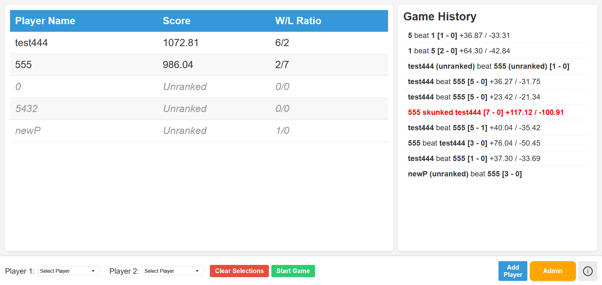

# Ping Pong Pi 🏓

A real-time ping pong scoreboard and statistics tracker optimized for TV displays. Track matches, player rankings, and game history with a clean, modern interface.

## Features

- **Real-time Scoreboard**: Large, clear display designed for TV viewing
- **Player Rankings**: ELO-based ranking system
- **Game History**: Track recent matches and outcomes
- **Dual Authentication**:
  - Google Authentication with cloud sync
  - Local Storage mode for offline use
- **Customizable Settings**:
  - Score change K-factor
  - Point difference weight
  - Activity threshold
  - Custom scoreboard colors
  - Game history retention

## Screenshots

## Tech Stack

- React
- Firebase Authentication
- CSS3 with custom animations
- Local Storage API

## Getting Started

### Usage

- Login: Choose between Google Authentication or Local Storage mode
- Add Players: Create player profiles through the admin interface
- Start Game: Select two players and begin tracking scores
- View Stats: Check the leaderboard for rankings and game history

### Customization

The app includes several customizable settings:

- Score change K-factor
- Point difference weight
- Activity threshold
- Default rank
- Scoreboard colors
- Game history retention

### Credits

- Designed and developed entirely by Adam Nelson-Archer. Check out my other web-based projects at [adamnelsonarcher.com/demos](https://adamnelsonarcher.com/demos).
