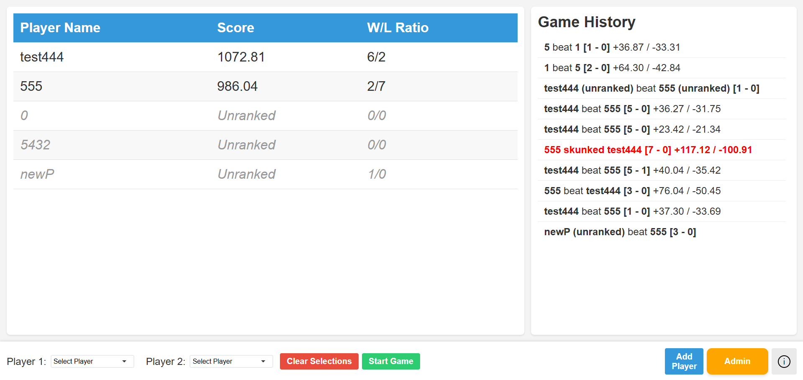

# Ping Pong Pi 🏓

A real-time ping pong scoreboard and statistics tracker optimized for TV displays.
Track matches, player rankings, and game history with a clean, modern interface.

## Features

- **Scoreboard built for a TV** — huge, high-contrast, sized in viewport units so it
  fills any screen. Driven from a numeric keypad: `7`/`8` and `4`/`5` for the two
  scores, `1` to end, `3` to quit (each confirmed by a second press).
- **ELO-style rankings** with margin-of-victory weighting, an upset bonus, and
  separate season and lifetime ratings.
- **Game history** with placement matches, skunk detection and rating changes.
- **Per-player stats** — win rate, streaks and a lifetime rating graph (double-click
  a leaderboard row).
- **Two ways to store data**
  - *Local storage* — no account, no network, everything stays on the device.
  - *Google sign-in* — synced through Firestore, with the account derived from a
    verified ID token.
- **Undo** the last match, including its effect on both ratings.
- **Backup and restore** as JSON from the admin panel.

## Screenshots



## Tech Stack

- React 18, built with Vite (tests on Jest)
- Firebase Authentication + Firestore, via a small Express API on Vercel
- CSS custom properties for theming; no UI framework

## Getting started

```bash
npm install
cp .env.example .env.local   # then fill it in
npm run dev                  # API on :3001, app on :3000
```

`npm run dev` runs the API server and the React dev server together. The dev server
proxies `/api/*` to the API, so the app talks to the same relative URLs it uses in
production.

Local-storage mode needs no configuration at all — only Google sign-in requires
Firebase credentials.

### Configuration

Copy `.env.example` to `.env.local` and fill it in. Two groups of variables:

| Prefix | Visibility |
|---|---|
| `FIREBASE_*` | **Server only.** The service-account private key. Full admin access to the Firestore project — treat it like a root password and never commit it. |
| `REACT_APP_FIREBASE_*` | Compiled into the public bundle. Expected and fine: a web API key is an identifier, not a secret. |

In production these are Vercel project environment variables, not a file.

### Scripts

| Command | Does |
|---|---|
| `npm run dev` | API + app together, for development |
| `npm start` | App only (Vite dev server) |
| `npm run server` | API only, on port 3001 |
| `npm test` | Run the Jest suite |
| `npm run build` | Production build (Vite) into `build/` |
| `npm run preview` | Serve the production build locally |

## Usage

- **Sign in** — pick Google or local storage.
- **Set an admin password** on first run. It gates the settings panel.
- **Add players.** A per-player password is optional; it exists only to stop
  someone picking your name by mistake on a shared display, and is not a security
  control.
- **Start a game** — select two players and go.
- **Check the leaderboard** for rankings; double-click a player for their stats.

Players appear in the ranked table once they have played `ACTIVITY_THRESHOLD`
games; before that they show as unranked and their matches count as placement
matches.

## Settings

All configurable from Admin → Game Settings:

| Setting | Effect |
|---|---|
| `SCORE_CHANGE_K_FACTOR` | Base points at stake per game |
| `POINT_DIFFERENCE_WEIGHT` | How much the margin of victory raises the stakes |
| `ACTIVITY_THRESHOLD` | Games needed to become ranked |
| `DEFAULT_RANK` | Label shown instead of a score for unranked players |
| `GAME_HISTORY_KEEP` | How many matches to *display* — older ones are kept, not deleted |
| `ADDPLAYER_ADMINONLY` | Moves "Add Player" into the admin panel |
| `PLAYER1/2_SCOREBOARD_COLOR` | Scoreboard colours |
| `DISABLE_WIN_ANIMATION` | Turns off the victory animation |

Theme (light/dark) is set per device, so a wall display and a phone can differ.

## Documentation

See [`docs/`](docs/README.md) for the architecture, a full code audit, remediation
status, and the roadmap.

## Credits

Designed and developed entirely by Adam Nelson-Archer. Check out my other web-based
projects at [adamnelsonarcher.com/demos](https://adamnelsonarcher.com/demos).
